- What is Kubernetes
- Why Kubernetes is Popular?
- Understanding Kubernetes Architecture
- Role of Docker in Kubernetes
- How to create and configure Kubernetes Cluster in Google Cloud
- How to deploy Hello World Rest API Image in Kubernetes Cluster
- Tools/Plugins used in Kubernetes
- Kubernetes Commands

### What is Kubernetes?

As per Kubernetes documentation, ``Kubernetes (also known as k8s or "kube")`` is a portable, extensible, open-source platform for managing containerized workloads and services, that facilitates both declarative configuration and automation. It has a large, rapid growing ecosystem. Kubernetes services, support, and tools are widely available.

In simple words, you can cluster together groups of hosts running Linux containers, and Kubernetes helps you easily and efficiently manage those clusters.

### Why is Kubernetes so Popular?

More than just enabling a containerized application to scale, Kubernetes has release-management features that enable ``updates with near-zero downtime``, ``version rollback``, and ``clusters that can 'self-heal'`` when there is a problem. ``Load Balancing``, ``Auto-Scaling`` and ``SSL`` can easily be implemented. Plugins like Helm, has revolutionized the world of server management by making multi-node data stores like Redis and MongoDB incredibly easy to deploy.

And also using Kubernetes for solutions that are already containerized can drastically reduce development time spent on operations and deployment. However, the effort of migration existing brown-field applications or legacy solution to be container-based so that Kubernetes can be used may be a viable solution.

### Understanding Kubernetes Architecture

Kubernetes Architecture has the following main components:

 - Master Node(s)
 - Worker/Slave Node(s)
 - Distributed Key-Value Store(etcd)
 
 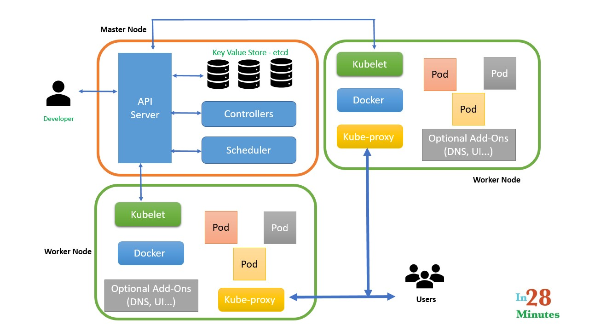
 
#### Master Node(s)

It will perform all administrative tasks like responsible and managing the Kubernetes cluster. There can be more than one master node in the cluster to check for fault tolerance. If we have more than one master node which makes system in a High Availablity mode, in which one of them will be the main node which we perform all the tasks.
It consists of 4 components:
   1. API Server
   2. Scheduler
   3. Controller Manager
   4. Etcd

#### Worker Node(s)

It acts like a physical server or you can say a VM which runs the applications using Pods (a pod scheduling unit) which is controlled by the master node. On a physical server (worker/slave node), pods are scheuduled. In order to access the application from the external world, we will connect to work nodes.

It consists of the following components:
1. Container runtime
2. Kubelet
3. Kube-proxy
4. Pods

#### Distributed Key-Value Store(Etcd)

etcd is written in the Go programming language. It is a distributed key-value store which stores the cluster state, it can be part of the Kubernetes master or, it can be configured externally. Along with storing the cluster state, it is also used to store configuration details such as subnets, ConfigMaps, Secrets, etc.

### Role of Docker in Kubernetes

Docker plays a pivotal role in Kubernetes architecture. It can be used as a container runtime that Kubernetes orchestrates. When Kubernetes schedules a pod to a node, the kubelet on that node will instruct Docker to launch the specified containers.

The kubelet then continuously collects the status of those containers from Docker and aggregates that information in the master. Docker pulls containers onto that node and starts and stops those containers.

Using Kubernetes with Docker is that an automated system asks Docker to do those things instead of the admin doing so manually on all nodes for all containers.

### How to configure Kubernetes Cluster in Google Cloud


Let's start with creating a Google Cloud Account

#### Creating A Google Cloud Free Trial Account

Make sure that you're logged into your Google account and go to the website [cloud.google.com](cloud.google.com). 

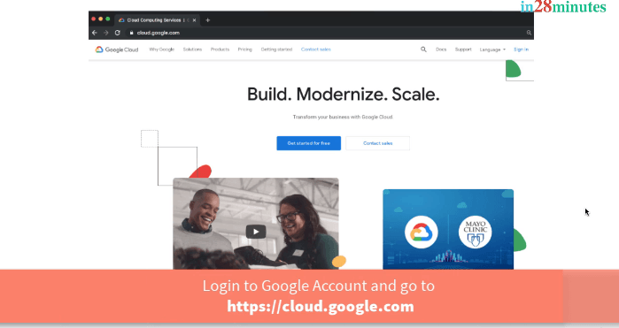

Click the button ```Get Started For Free```. 

Choose your country, read the ```Terms of Services```, and agree to them. 

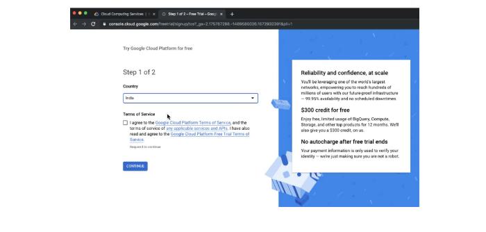

At the time of writing this, Google free trial account gives you ```$300``` credit, as well as free access to a number of Google services for about 12 months. 

> Google does not auto charge you after the free trial ends. 

Click ```Continue```. 

You will be asked a lot of details. Follow the screens and enter the requested details.
- Choose your account type
- Enter your tax information
- Enter your address information
- Choose your payment method and card details (Go through the card verification process which can change based on the country you are in)
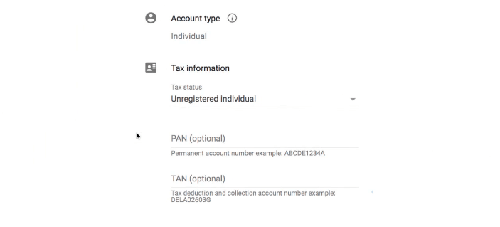
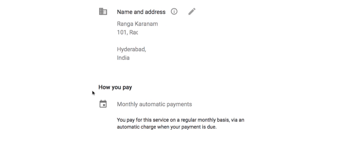
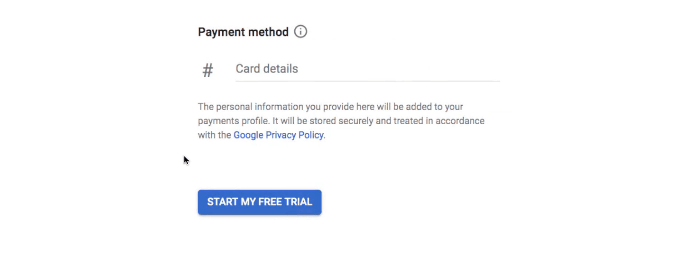
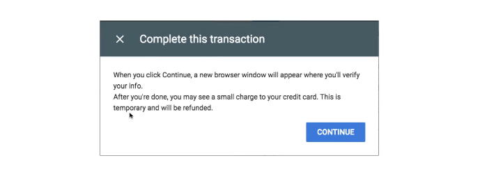
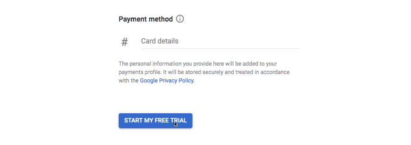

After entering all the details, click```Start My Free Trial``` button. 

And at the end of it, you should land up on a screen like this. 

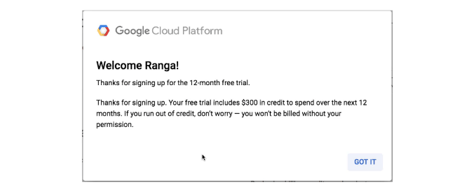

#### Creating A Kubernetes Cluster With Google Kubernetes Engine - GKE

Let's understand the important terminology used in Kubernetes - `cluster`, `nodes` and `master nodes`.

This is the best way I found to define Kubernetes
> Kubernetes is the best resource manager ever. 

What does Kubernetes manage? 

Among the important things that Kubernetes manages is your servers and these servers are in the cloud. So, Kubernetes manages your virtual servers.

> Kubernetes can also manage servers in your data centers.

Different cloud providers have different names for these virtual servers:
- Amazon calls them EC2, or Elastic Compute Cloud. 
- Azure calls them virtual machines
- and Google Cloud calls them compute engines.

Kubernetes uses a very generic terminology and calls virtual servers as `nodes`.

Kubernetes can manage thousands of such `nodes`.

What do we do when you have thousands of things to manage? 

You introduce managers. 

To manage thousands of Kubernetes nodes, you have a few `master nodes`. 

Typically, you'll have one master node, but when you need high availability, you can have for multiple master nodes.

Here is a picture showing the typical Kubernetes Cluster:

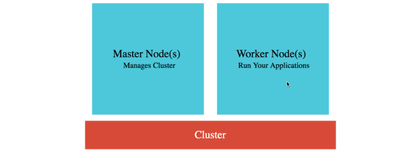

A cluster is nothing but a combination of nodes and the master node. 
- The nodes that do the work are called worker nodes or simply `nodes`.
- The nodes that do the management work are called `master nodes`. 

## Prerequisites

Here are the prerequisites for creating a Kubernetes cluster
- Login into your Google Cloud Account [cloud.google.com](cloud.google.com) and launch up ```Console```. 
- Choose the project - ```My First Project```. By default, this should be already chosen. 
- Enable Kubernetes Engine - Type ```Kubernetes``` into search drop down, and click the ```Kubernetes Engine``` icon. It would take a little while before the Kubernetes Engine is activated. (screenshot below)

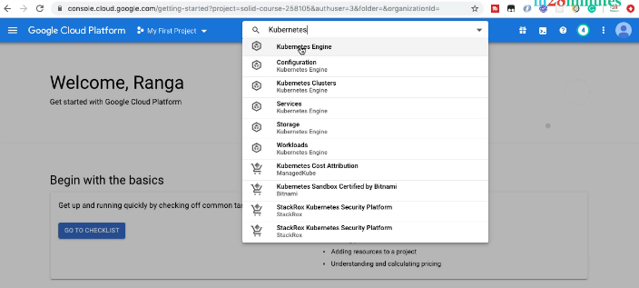

#### Overview of the Kubernetes Dashboard

Let's get a quick overview of the Kubernetes Engine Dashboard.

Here are some of the important items in your left hand side menu:
- ```Clusters``` - You can create and manage clusters. 
- ```Workloads``` - You can manage the applications or the containers that you would want to deploy into the cluster.
- ```Services & Ingress```- Some of your workloads might be REST API or web applications. You would want to provide access to external world to these workloads. Services give external world access to applications which are deployed into Kubernetes clusters. 
- ```Configuration``` to store your application configuration
- ```Storage``` to provide persistent data storage for your application. 

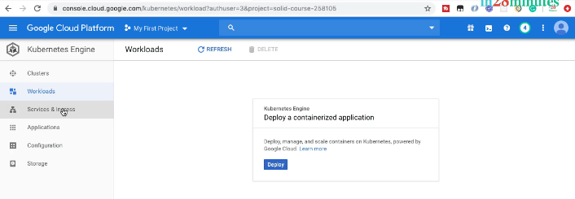


#### Creating a Kubernetes Cluster

Let's get started with creating a cluster. 

Let's click ```Create Cluster```. 
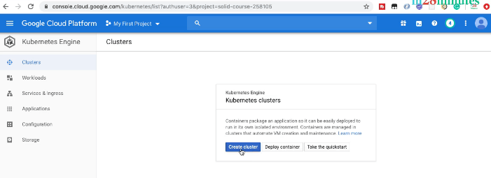

When you're creating a cluster, you would need to choose 
- How powerful your cluster is? You can choose the type of nodes and number of nodes
- Where should your cluster be located?
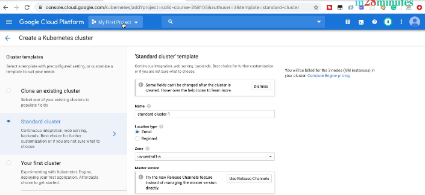


Here are some of the choices we will make next:
- Name the cluster as ```in28minutes-cluster```, locate it in ```us-central1-a```. 
- Choose the default Kubernetes version. 
- We will start with three nodes in our cluster, choosing general-purpose nodes. 

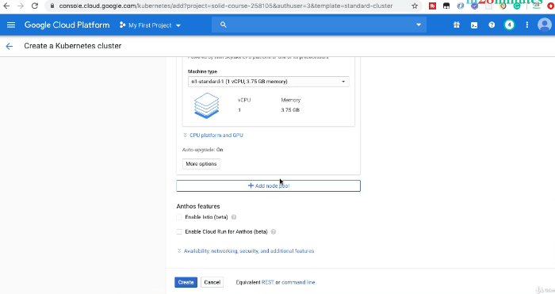


Google Cloud provides a variety of nodes: 
* CPU optimized 
* Memory optimized
* GPU optimized, for graphics. 

We'll stick to the basics and choose the defaults.

With each of these nodes, we get one virtual CPU, and about ```3.75 GB``` of memory. 

Let's go ahead and click ```Create```. 

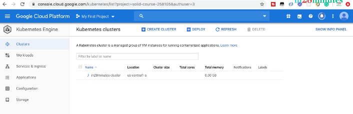


This would kick start the creation of a Kubernetes cluster. It would take about five minutes to create the cluster.

While the creation of the cluster is in progress, let's look at a few fun facts related to Kubernetes. 

### How Kubernetes Is represented

Kubernetes' abbreviation is ```K8S```. ```K8S``` actually stands for Kubernetes. So, K 8 letters, and S. 

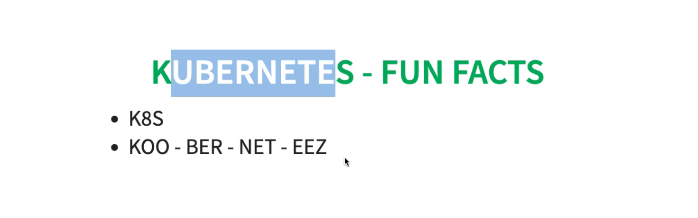

The next interesting fact is Kubernetes is pronounced as ```Coo-ber-net-is```. The next time you see a friend of yours saying Cubernetis or something like that, correct him to say ```Kubernetes```. 

The next interesting fact is logo - ```Helmsman```. 

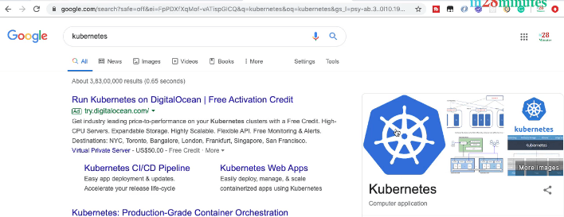

The logo of Kubernetes represents somebody who is providing direction to a ship. In olden days on a ship, you had something like this to manage the direction of the ship, and this was the role of somebody called a ```Helmsman```. Kubernetes manages things, and that's where its logo, the Helmsman, comes from. 

### Kubernetes And Cloud Providers

The last interesting fact is Kubernetes on the cloud. Different cloud providers provide different services for Kubernetes. 

* Azure calls it AKS, Azure Kubernetes service. 
* Amazon calls it EKS, Elastic Kubernetes Service, and 
* Google calls it GKE, Google Kubernetes Engine. 

Okay, that's end of the fun facts! Let's see if our cluster is ready. 

### Readiness of The Launched Kubernetes Cluster

We can an icon saying that a cluster is running. 

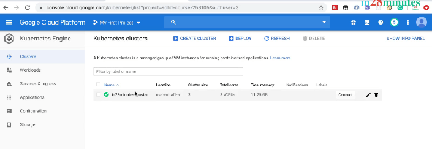

On the screen, bit of generic information about this cluster is displayed. It has three nodes, three virtual CPUs, and ```11.25 GB``` of memory. 

We saw that each of the nodes had three parts of ```3.75 GB```, which is summed up here as ```11.25 GB```. Now, let's go inside where you can see some more generic information about this cluster. 

#### Viewing Generic Cluster Information

You can see all the following: 

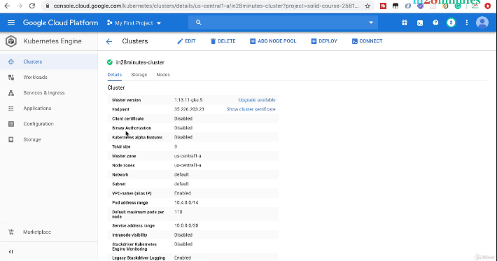

* The version of Kubernetes it makes use of 
* The total size
* The location of where the master node and worker nodes are present 
* And a few other details about the cluster. 

If you go to the nodes, the details of all the nodes are also present. On the screen, you can see more information about the nodes. 

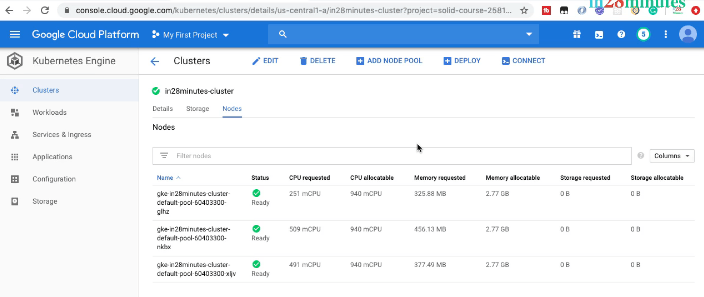

There are three nodes, and some amount of CPU has already been requested on these specific nodes. How much CPU and memory is available for new applications on these specific nodes, is also displayed. 

#### Kubernetes Takes A Cut Of Resources

Let's talk about something very very important before we move on. When we created the nodes, we created them with ```1 vCPU``` and about ```3.75 GB``` of memory. 

However, right now there is only about ```2.75 GB``` of memory that is available on each of these nodes. What is happening with the rest of the memory? Who is making use of it? 

The answer is Kubernetes. Kubernetes needs to manage the nodes and like every manager, and takes a cut. It says - "Hey, I need to do a lot of work to manage these nodes. So, reserve some CPU and some memory for the work I need to do with these nodes".

### How to deploy Hello World Rest API Image in Kubernetes Cluster

We will go through the steps involved in deploying an application into Kubernetes Cluster..

### Step1: Connecting To The Kubernetes Cluster 

The first step is actually to connect to the Kubernetes cluster. We are awesome programmers; we will use the command line!

Typically, when we want to use command line, we would need to install a lot of software. However, Google Cloud really makes it very very easy. It provides you something called ``Google Cloud Shell``. 

### Step2: The Google Cloud Shell

First thing, make sure that you are inside the cluster. 

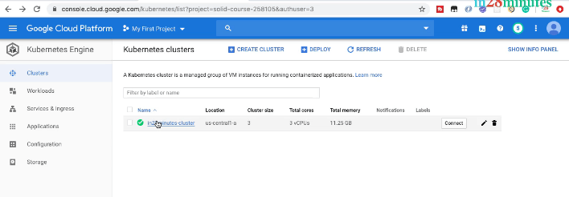
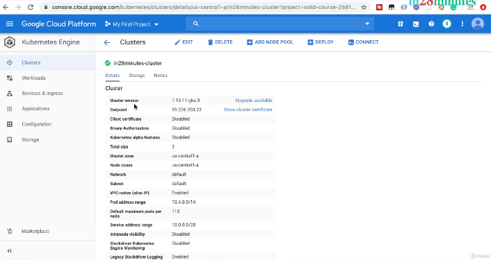

Also, now activate cloud shell. 

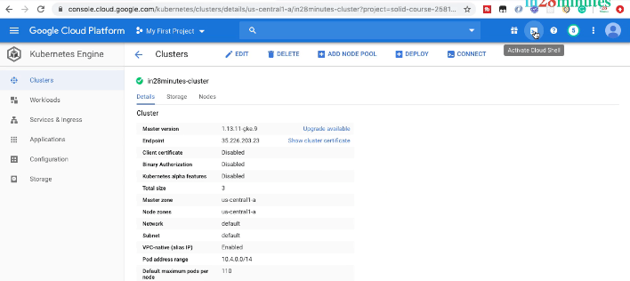

There's an icon present down here to activate the cloud shell. When you click it, the cloud shell opens up. If this the first time you are launching up Cloud Shell, it might take a few minutes.  

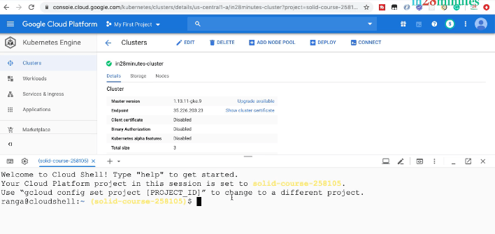

We've customized our Cloud Shell to suit our purpose. We're using terminal preferences, color themes of light, and have made the text size large.

The rest of the screen is actually your interface for the Google Cloud Platform, and that's not really convenient for us to use. That's why the way we prefer using cloud Shell is in its own window. 

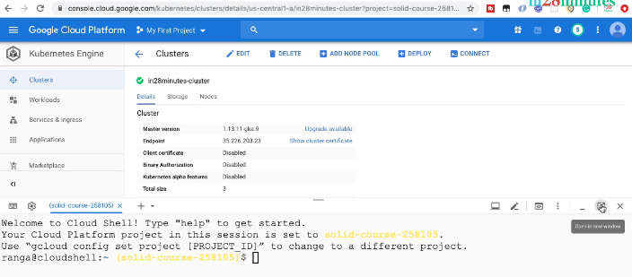

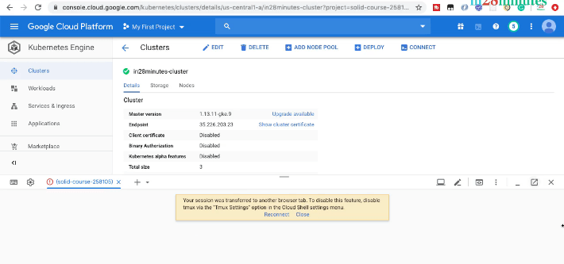

You can click this icon, which says: ```Open In New Window```. It's now launched up separately. 

We have a complete UI for the cloud platform also available for us in Cloud Console. We'd want to connect to this cluster. 

#### Step3: Connecting To The Cluster

Click the ```Connect``` icon present in here, to copy the command to click, and run it in here. This command is a Google Cloud command to connect to the cluster. 

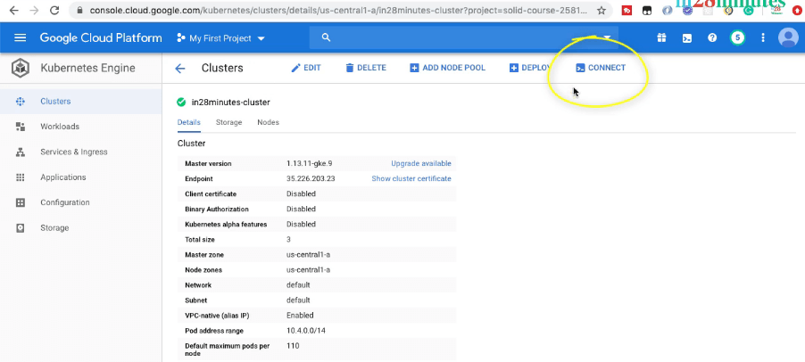

We're connecting to the in28minutes cluster that we created earlier. We are connecting to the cluster which is in zone ```us-central1-a``` and we're using the project ID for our project.

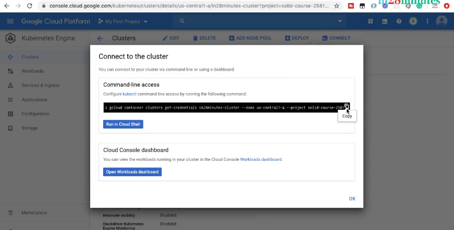

The project that we are using is ```My First Project```, the ID for hich is ```solid-course-258105```. 

So, that's the entire command that we are executing to connect to the cluster. Now, we are connected to the cluster. We would want to run commands against this cluster. 

### Overview of kubectl

```kubectl``` is short form for ```Kube controller```. Kubectl is a command line interface for running commands against Kuberntes clusters. We have to remember this command and because we will be using frequently.

```kubectl``` is an awesome Kubernetes command to interact with the cluster. Beautify of this command is, it will work with any Kubernetes cluster, irrespective of whether the cluster is in your ``local machine``, ``datacenter``, or ``in the cloud``.

Use the following syntax to run ``kubectl`` commands from your terminal window:

``kubectl [command] [TYPE] [NAME] [flags]``

 where ``command``, ``TYPE``, ``NAME``, and ``flags`` are: 

* ``command``: Specifies the operation that you want to perform on one or more resources, for example ``create``, ``get``, ``describe``, ``delete``.

*  ``TYPE``: Specifies the resource type. Resource types are case-insensitive and you can specify the singular, plural, or abbreviated forms. For example, the following commands produce the same output: 

    ``kubectl get pod pod1``

    ``kubectl get pods pod1``

    ``kubectl get po pod1``
  
 * ``NAME``: Specifies the name of the resource. Names are case-sensitive. If the name is ommitted, details for all resources are displayed, for example ``kubectl get pods``.

Once you connect to the cluster, you can execute commands against any cluster using ```kubectl```. ```kubectl``` can do a lot of powerful things for you with Kubernetes. 

* Deploy a new application
* Increase the number of instances of an application
* Deploy a new version of the application

```kubectl``` is readily available and installed in the Cloud Shell. Let's go ahead and type in ```kubectl version```. 

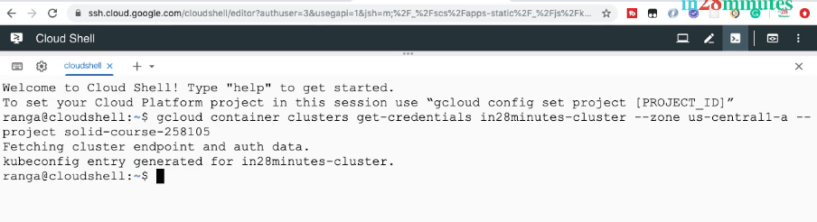

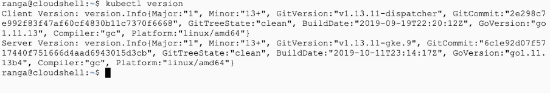

It displays both the client and server version. The server version is the cluster that we are connecting the ```kubectl``` to. 

### Step4: Deploying An Application

Now we have launched up Cloud Shell, are connected to the cluster, and are ready to execute commands against the cluster. 
We would want to deploy an application. 

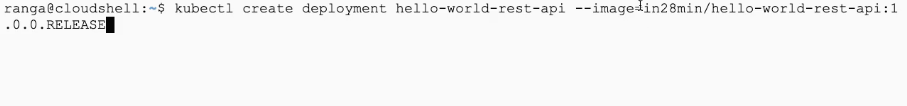

Execute below commands for deploying an application into a cluster.

```kubectl create deployment [deployment application name] --image=[container image from DockerHub Repository]```

```kubectl create deployment hello-world-rest-api --image=in28min/hello-world-rest-api:0.0.1.RELEASE``` 
and call this deployment ```hello-world-rest-api``` .

We are going to deploy a REST API which has just ```Hello World``` in ```hello-world-rest-api```, and say ```--image=...``` by providing the container image. 

What does the container image that we would want to make use of? ```in28min/hello-world-rest-api:1.0.0.RELEASE```. Make sure you get this right. 

#### Where The Docker Image Comes From

Now, you might be wondering where is this image coming from? What does ```in28min/hello-world-rest-api:1.0.0.RELEASE``` contain, and how was it created? 

This is the Docker image for the REST API that we would want to deploy. If you are familiar with Docker images, you know that there are a few steps which are involved in creating Docker images and pushing out to Docker Hub. 

What we have done is to help you get started quickly, we have already created a Docker image for the Hello World REST API, and pushed it to the Docker repo which is Docker Hub. 

If you go to [hub.docker.com/u/in28min](hub.docker.com/u/in28min) and look for ```in28min/hello-world-rest-api```, there is a repository which is already present in here. 

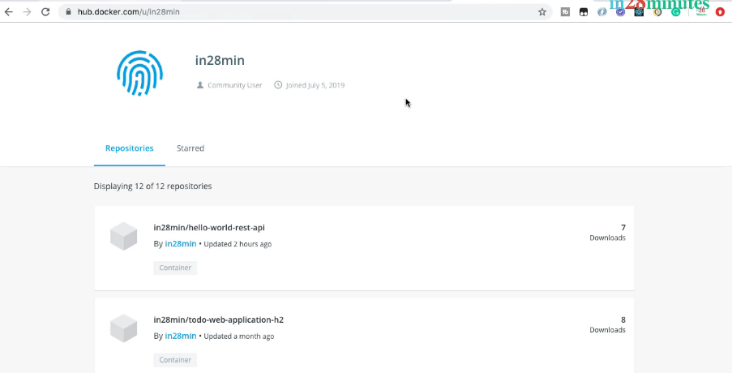

If you go to the tags, there are a few releases for these applications already present. 

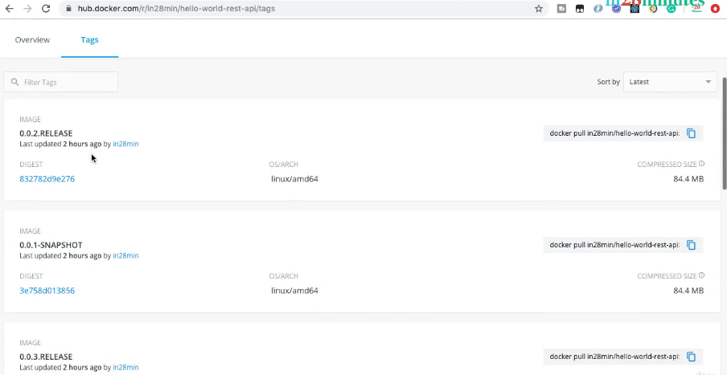

The one which we are making use of right now is this ```0.0.1.RELEASE```. We are right now trying to deploy this image. For a moment let's not worry about creation of docker image. 

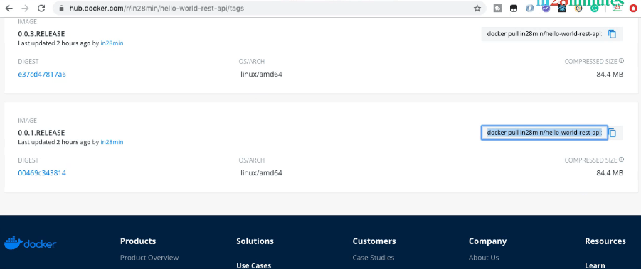

For subsequent applications, we'll create Docker images, deploy them to Docker Hub, and use them from Kubernetes. 
For now, let's keep our focus on understanding Kubernetes. 

You can find this command on the GitHub repository of the course []() as well. 

Make sure that you don't have any typographic errors - it's ```--image=in28min/hello-world-rest-api:0.0.1.RELEASE```. You can also copy the entire tag from here.  

```kubectl create deployment hello-world-rest-api --image=in28min/hello-world-rest-api:0.0.1.RELEASE```

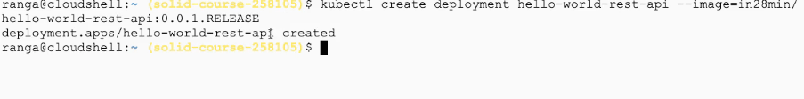

This command would deploy the application to a Kubernetes cluster, and gives you a deployment ID. The deployment is now created. 

### Exposing The Created Deployment

We can expose our app publicly. For this, we have another command - ```kubectl expose deployment```. The name of the deployment we want to expose is ```hello-world-rest-api```. 

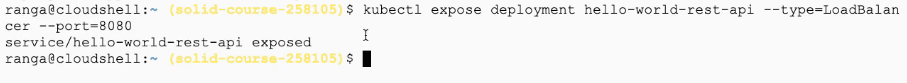

We would want to expose it as a load balancer - ```--type=load-balancer```. We want to expose it on port ```8080```. The entire command turns out to be  ```kubectl expose deployment hello-world-rest-api 123 --type=LoadBalancer 124 --port=8080```.

This would expose our app publicly. There is a service which is being exposed right now. We want to find out the status of creation of these. 

### Verifying The Deployment

We will go to the UI and check that up. Let's go to ```Service & Ingress```. 

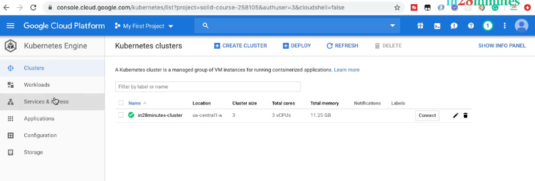

It's creating service endpoints. If you wait for a little while, you'd see that a ```OK``` button comes in. 

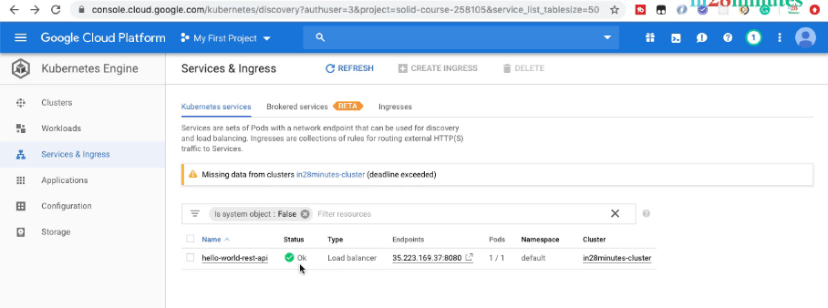

So, the status is now OK. 

It says ```hello-world-rest-api``` is all available, and at the following endpoints. Let's see what's available at the endpoint, by clicking on the endpoint link. 

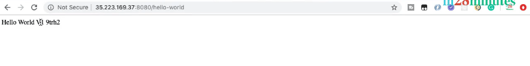

It says ```{healthy:true}``` and the REST API which is exposed from here is at ```/hello-world```. The message ```Hello World V1``` is also displayed. 

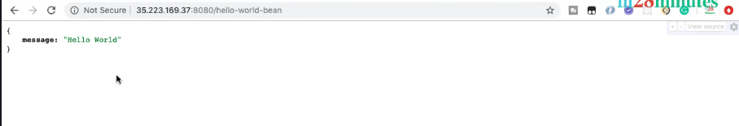

The important thing is when you execute this URL, you are getting a response back. The other URLs which are present in this specific services are ```hello-world-bean```, which returns a JSON response. 

### The Kubernetes Deployment In Perspective

The most important thing is with just two simple commands, we were able to get the entire thing working. 

We were able to pick up an image from the Docker Hub, deploy to Kubernetes, and expose it as a service to the outside world. Congratulations for successfully deploying your first application to Kubernetes!


 
 
 
